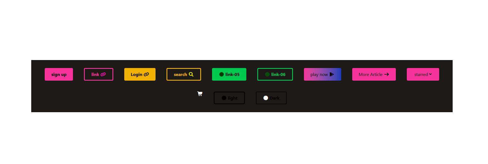

# tailwind css project number 1
 

 Here’s a clean `README.md` you can use for your project:

---

# 🎨 Tailwind Button UI Demo

This project is a simple HTML page showcasing a variety of styled buttons using **Tailwind CSS** and **Font Awesome icons**.

## 🚀 Features

* Multiple button styles:

  * Solid buttons
  * Outline buttons
  * Gradient buttons
* Icon integration using Font Awesome
* Responsive flex layout
* Dropdown inside a button
* Dark-themed container

[live@](https://jishnusmanoj2004-gif.github.io/button-project-1/)



## 🛠️ Technologies Used

* **HTML5**
* **Tailwind CSS (via CDN)**
* **Font Awesome (icons)**

## 📂 Project Structure

```
project-folder/
│── index.html
│── README.md
```

## ▶️ How to Run

1. Download or clone this project.
2. Open the `index.html` file in your browser.
3. No build tools or installation required (CDN-based setup).

## 📌 Notes / Fix Suggestions

There are a few small issues you may want to clean up:

* ❌ `w[900px]` → should be `w-[900px]`
* ❌ `font bold` → should be `font-bold`
* ❌ `border-3` → Tailwind uses `border`, `border-2`, etc.
* ❌ `text-white-        500` → contains spacing error
* ❌ `text-beige-900` → not a default Tailwind color

## 💡 Improvements You Can Add

* Hover effects (`hover:bg-*`, `transition`)
* Button click interactions with JavaScript
* Dark/light mode toggle
* Accessibility improvements (ARIA labels)

## 📸 Preview

A centered layout with colorful buttons including:

* Signup
* Login
* Search
* Play Store
* Dropdown selector
* Light/Dark buttons

